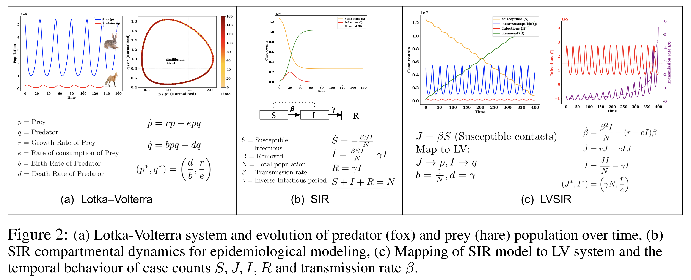
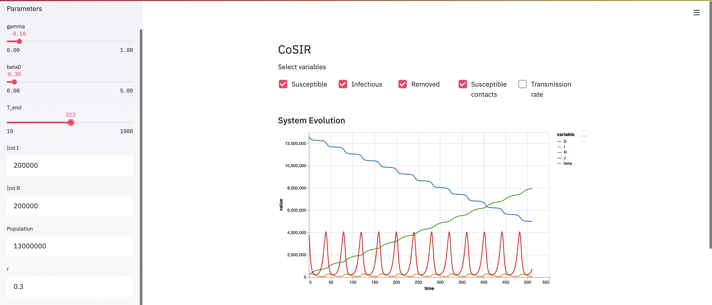

# CoSIR: Managing an Epidemic via Optimal AdaptiveControl of Transmission Policy

The code for our paper **CoSIR: Managing an Epidemic via Optimal AdaptiveControl of Transmission Policy**
## [CoSIR: Managing an Epidemic via Optimal AdaptiveControl of Transmission Policy](https://www.medrxiv.org/content/10.1101/2020.11.10.20211995v1.full.pdf)

[Harsh Maheshwari](https://harshm121.github.io), [Shreyas Shetty](https://in.linkedin.com/in/shreyasshetty), [Nayana Bannur](https://www.linkedin.com/in/nayana-bannur/) and [Srujana Merugu](https://www.linkedin.com/in/srujana-merugu-a7243819/).


## Proposed Method


### Code description
1. *models.py*: The epidemilogical model equations
2. *solvers.py*: Discrete and continuous solvers for the epidemilogical given inital conditions
3. *plots.py*: The scripts to create plots presented in the paper
4. *createPlots.ipynb*: Wrapper notebook and contains the parameters used to generate plots
5. *baselines.ipynb*: Evaluates CoSIR against other baselines.

### Clone this repository
```
git clone https://github.com/dsindiavscovid/sir-control.git
```

## SteamLit Applications

1. Install Streamlit, version 0.67.1
2. Run streamlit on your local machine using the following command:
```
streamlit run mainStreamLit.py 
```
3. Use the dynamic interface to see the plots for different parameter settings




## Citation
```
@article {Maheshwari2020.11.10.20211995,
	author = {Maheshwari, Harsh and Shetty, Shreyas and Bannur, Nayana and Merugu, Srujana},
	title = {CoSIR: Managing an Epidemic via Optimal Adaptive Control of Transmission Policy},
	elocation-id = {2020.11.10.20211995},
	year = {2020},
	doi = {10.1101/2020.11.10.20211995},
	publisher = {Cold Spring Harbor Laboratory Press},
	URL = {https://www.medrxiv.org/content/early/2020/11/13/2020.11.10.20211995},
	eprint = {https://www.medrxiv.org/content/early/2020/11/13/2020.11.10.20211995.full.pdf},
	journal = {medRxiv}
}
```
