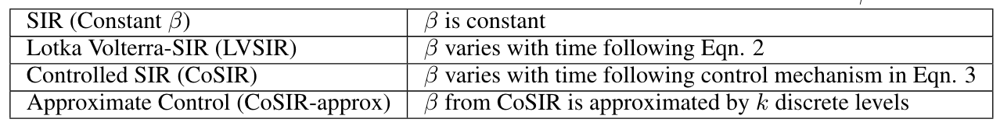

# CoSIR: Managing an Epidemic via Optimal AdaptiveControl of Transmission Policy

The code for our paper **CoSIR: Managing an Epidemic via Optimal Adaptive Control of Transmission Policy**
## [CoSIR: Managing an Epidemic via Optimal Adaptive Control of Transmission Policy](https://www.medrxiv.org/content/10.1101/2020.11.10.20211995v1.full.pdf)

[Harsh Maheshwari](https://harshm121.github.io), [Shreyas Shetty](https://in.linkedin.com/in/shreyasshetty), [Nayana Bannur](https://www.linkedin.com/in/nayana-bannur/) and [Srujana Merugu](https://www.linkedin.com/in/srujana-merugu-a7243819/).


## Abstract

```
Multiple macro-phenomena such as disease epidemics, online information propagation, and economic activity can be well-approximated using simple dynamical systems. Shaping these phenomena with adaptive control of key levers has long been the holy grail of policymakers. In this paper, we focus on optimal control of transmission rate in epidemic systems following the widely applicable SIR dynamics. We first demonstrate that the SIR model with infectious patients and susceptible contacts (i.e., product of transmission rate and susceptible population) interpreted as predators and prey respectively reduces to a Lotka-Volterra (LV) predator-prey model. The modified SIR system (LVSIR) has a stable equilibrium point, an “energy” conservation property, and exhibits bounded cyclic behavior. We exploit this mapping using a control-Lyapunov approach to design a novel adaptive control policy (CoSIR) that nudges the SIR model to the desired equilibrium. Combining CoSIR policy with data-driven estimation of parameters and adjustments for discrete transmission levels yields a control strategy with practical utility. Empirical comparison with periodic lockdowns on simulated and real COVID-19 data demonstrates the efficacy and adaptability of our approach.
```


## Web Application for CoSIR

Link to the webapp: [http://cosir.herokuapp.com/](http://cosir.herokuapp.com/)


## Types of Models




## Folder Structure

```
.
├── README.md
├── data	#contains global confirmed, deaths, and recoveries downloaded from https://github.com/CSSEGISandData/COVID-19
├── experiments1.ipynb	#Jupyter notebook which runs the 1st set of experiments - considering hypothetical city
├── experiments2.ipynb	#Jupyter notebook which runs the 2nd set of experiments - India and Netherlands
├── figures
│   ├── experiments1	#Figures generated for the hypothetical city
│   ├── experiments2	#Figures generated for the India and Netherlands
│   └── readmeFigures
└── src
    ├── mainStreamLit.py	#Streamlit webapp
    ├── models.py	#Contains model equations for SIR, LV, LVSIR and CoSIR
    ├── plot.py	#Utility functions to create plots
    ├── presentation.mplstyle	#Matplot lib config file
    └── solvers.py	#Contains equation solvers for specific models

```


## Model Equations

In the *models.py* file, these are the model equations for various models:

```python
1. def sir_equations(y, t, N, beta, gamma): # SIR equations, returns derivative of S, I and R w.r.t time. 

2. def lv_equations(y, t, r, e, b, d): # LV equations, returns derivative of Prey and Predator w.r.t time. 

3. def sir_lv_equations(y, t, N, r, e, gamma): # LVSIR equations, returns derivative of S, I, R and beta w.r.t time. 

4. def sir_lv_control_equations(y, t, N, r, e, gamma, eta): # CoSIR equations, returns derivative of S, I, R and beta w.r.t time
```


## Equation Solvers

In the *solvers.py*, these functions solve the various ODEs:

```python
1. def solve_sir(S0, I0, R0, N, beta, gamma, t): # Solves SIR Equations using scipy's odeint.
    """
    S0, I0, R0 - Initial values on the S, I, R buckets
    N - Total population size
    beta, gamma : Model parameters
    t - Grid of time points (in days)
    """ 

2. def solve_lv(X0, Y0, r, e, b, d, t): # Solves LV Equations using scipy's odeint.
    """
    X0, Y0 - Initial number of prey and predator
    r, e, b, d - Model parameters
    t - Grid of time points (in days)
    """ 

3. def solve_sir_lv(S0, I0, R0, beta0, N, r, e, gamma, t): # Solves LVSIR Equations using scipy's odeint.
    """
    S0, I0, R0 - Initial values on the S, I, R buckets
    beta0 - Initial value of beta0
    N - Total population size
    gamma : Gamma parameter
    t - Grid of time points (in days)
    """ 
 
4. def solve_sir_lv_control(S0, I0, R0, beta0, N, r, e, gamma, eta, t): # Solves CoSIR Equations using scipy's odeint.
    """
    S0, I0, R0 - Initial values on the S, I, R buckets
    beta0 - Initial value of beta0
    N - Total population size
    gamma : Gamma parameter
    eta : Learning rate for SG updates
    t - Grid of time points (in days)
    """ 

5. def solve_discrete_sir(init, beta, gamma, N, timesteps, delta_t=0.001): # Solves SIR Equations dicretely with the given delta t value. 
    """
        Discrete version of SIR model.

        init : Initial conditions
        beta : Sequence of beta values (constant or array)
        gamma : Gamma parameter of SIR model
        timesteps : Number of timesteps to consider (in units of days)
        delta_t : Spacing between points in the discretised version
    """ 

6. def solve_discrete_SEIR(init, beta, gamma, sigma, N, timesteps, delta_t=0.001): # Solves SEIR Equations dicretely with the given delta t value. 
    """
        Discrete version of SIR model.

        init : Initial conditions
        beta : Sequence of beta values (constant or array)
        gamma : Gamma parameter of SIR model
        timesteps : Number of timesteps to consider (in units of days)
        delta_t : Spacing between points in the discretised version
    """
  
7. def solve_discrete_delayedSir(init, beta, gamma, N, timesteps, delta_t=0.001, tau = 4): # Solves delayedSIR Equations dicretely with the given delta t value. 
    """
        Discrete version of SIR model.

        init : Initial conditions
        beta : Sequence of beta values (constant or array)
        gamma : Gamma parameter of SIR model
        timesteps : Number of timesteps to consider (in units of days)
        delta_t : Spacing between points in the discretised version
    """ 
```


## Clone this repository

```
git clone https://github.com/dsindiavscovid/sir-control.git
```

## SteamLit Application

1. Install Streamlit, version 0.68.1
2. Run streamlit on your local machine using the following command:
```
streamlit run mainStreamLit.py 
```
3. Use the dynamic interface to see the plots for different parameter settings


## Citation
```
@article {Maheshwari2020.11.10.20211995,
	author = {Maheshwari, Harsh and Shetty, Shreyas and Bannur, Nayana and Merugu, Srujana},
	title = {CoSIR: Managing an Epidemic via Optimal Adaptive Control of Transmission Policy},
	elocation-id = {2020.11.10.20211995},
	year = {2020},
	doi = {10.1101/2020.11.10.20211995},
	publisher = {Cold Spring Harbor Laboratory Press},
	URL = {https://www.medrxiv.org/content/early/2020/11/13/2020.11.10.20211995},
	eprint = {https://www.medrxiv.org/content/early/2020/11/13/2020.11.10.20211995.full.pdf},
	journal = {medRxiv}
}
```
